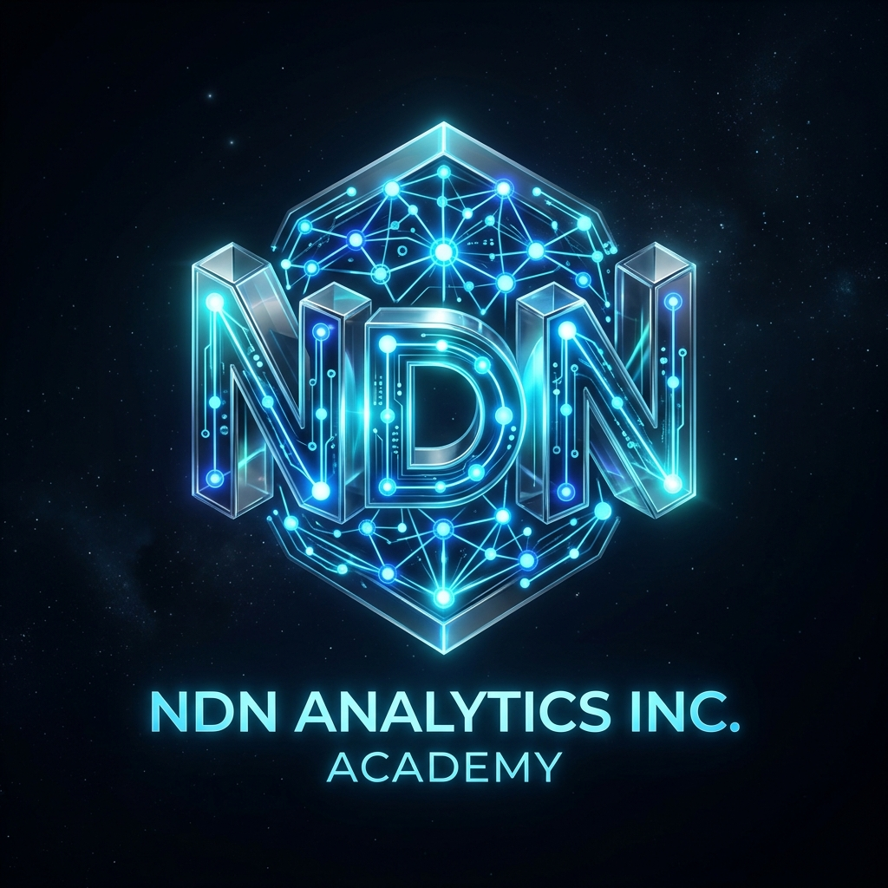

# NDN Analytics Academy App 🎓⚡

> **Official Learning & Certification Platform for NDN Analytics Inc.**  
> Founded & Directed by **MSc Desmond Nkefua** ([ndnanalytics.com](https://www.ndnanalytics.com/))



## 🌟 Overview
NDN Analytics Academy is an elite masterclass application platform designed for training AI Engineers, Google Cloud Platform (GCP) Cloud Architects, Firebase Full-Stack Developers, and Google Play Store Publishing Specialists.

## 🚀 Key Masterclass Tracks
1. **Full-Stack App Development with Firebase & GCP** (55 CPD)
2. **Google Cloud Platform App Architecture & Deployment** (60 CPD)
3. **Google Play Store App Development & Publishing** (45 CPD)
4. **Applied AI Engineering & Autonomous Gemini Agents** (90 CPD)
5. **BigData Analytics & MLOps with BigQuery ML** (50 CPD)

## 🛠️ Technology Stack
- **Core Engine**: React 19 + TypeScript + Vite 8
- **Styling**: Tailwind CSS + Google Fonts (Outfit, Plus Jakarta Sans, Fira Code)
- **Backend API**: Node.js + Express + Gemini 3.5 AI Gateway
- **3D Emblem**: Custom 3D Logo

## ⚡ Local Setup & Execution
```bash
# Install dependencies
npm install

# Launch live dev server
npm run dev

# Build production bundle
npm run build
```

---
© 2026 NDN Analytics Inc. All Rights Reserved.
